<!-- _class: lead -->
# Fermi-LAT analysis with **Fermipy** & **Gammapy**
### From an event list to a published spectrum

M. Crnogorčević · 105 min lecture
*Pre-requisites:* gamma-ray instruments, emission processes (brem/IC/sync/hadronic)

---

## What you will leave with

1. A working **mental model** of how a γ-ray analysis is actually done.
2. The ability to read someone else's `config.yaml` and know what every line means.
3. Knowing **which tool to reach for**: Science Tools / Fermipy / Gammapy.
4. A self-contained Docker image and notebooks to redo all of today on your own laptop.

We will analyse two real sources end-to-end:
- **PG 1553+113** — high-frequency BL Lac, our textbook clean point source. Bonus: ~2.2 yr quasi-periodic GeV modulation (Ackermann+ 2015).
- **TXS 0506+056** — the *neutrino blazar* (IceCube-170922A).

---

## Lecture roadmap

| Block | Topic | Time |
|-------|-------|-----:|
| I  | Recap: Fermi-LAT + γ-ray data product levels | ~15 min |
| II | The analysis stack: Science Tools → Fermipy → Gammapy. End-to-end on **PG 1553+113**, then **TXS 0506+056** | ~60 min |
| III | Same data in **Gammapy**, idea of joint multi-instrument fits | ~20 min |
| IV | Big picture, when-to-use-what, wrap-up | ~10 min |

Stop me. Always.

---

<!-- _class: lead -->
# Block I — Fermi-LAT recap & data products

---

## Fermi-LAT in 30 seconds

<div class="twocol">

**Pair-conversion telescope, 20 MeV – >1 TeV**

- Tracker: 18 Si-strip planes (W converter foils)
- Calorimeter: 8.6 X₀ CsI(Tl), hodoscopic
- ACD: segmented plastic scintillator (anti-coincidence)
- FoV ≈ 2.4 sr, all-sky in ~3 hours (rocking survey mode)
- On-orbit since 2008-06-11 → **17+ years** of public data

**Why this matters for analysis:**
- PSF is ENORMOUS at low energy (>3° at 100 MeV)
- → background-dominated, *forward-folded likelihood is mandatory*
- → no straightforward "ON/OFF" like IACTs

</div>

<div class="ref">Atwood et al. 2009, ApJ 697, 1071</div>

---

## The hierarchy of γ-ray data products

Every γ-ray instrument follows this chain (names differ).

| Level | Content | Fermi name | Who handles it |
|------:|---------|------------|----------------|
| **L0** | Raw telemetry | — | Mission Ops |
| **L1** | Calibrated, reconstructed events with all variables | "Pass 8" merit tuple | LAT team only |
| **L2** | Public event list + spacecraft pointing | **FT1, FT2** | **You** |
| **L3** | Binned counts/exposure cubes, IRFs, livetime | "intermediate" `.fits` | You (via tools) |
| **L4** | Source catalogs (4FGL-DR4, 4LAC, etc.) | catalog FITS | LAT team |

**You start at L2. Everything we do today is L2 → L3 → science.**

---

## The Fermi Science Tools ecosystem in one picture

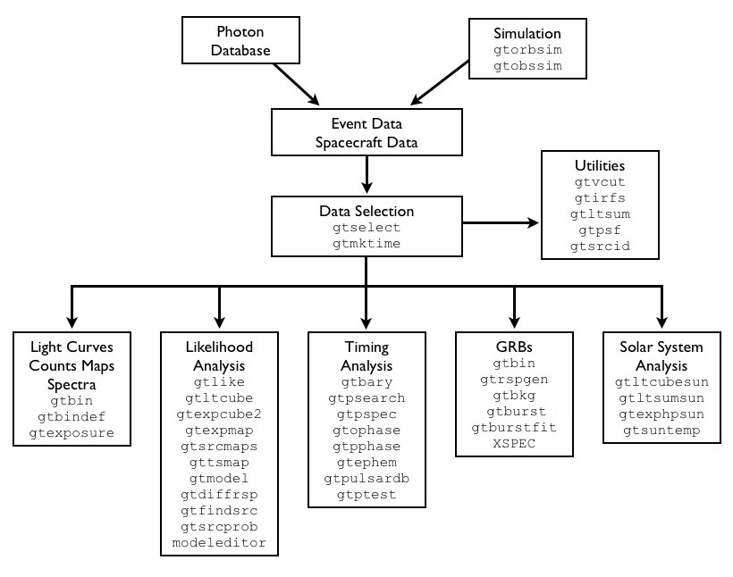

You will mostly live in:
- **Data Selection** → `gtselect`, `gtmktime`
- **Likelihood Analysis** → the central column
  (`gtlike`, `gtltcube`, `gtexpcube2`, `gtsrcmaps`, `gttsmap`, `gtfindsrc`, …)
- **Utilities** → `gtvcut`, `gtirfs`, `gtpsf`

Fermipy ≈ Python wrapper around the Likelihood Analysis column.

<div class="ref">credit: NASA/FSSC</div>

---

## Where the data actually lives

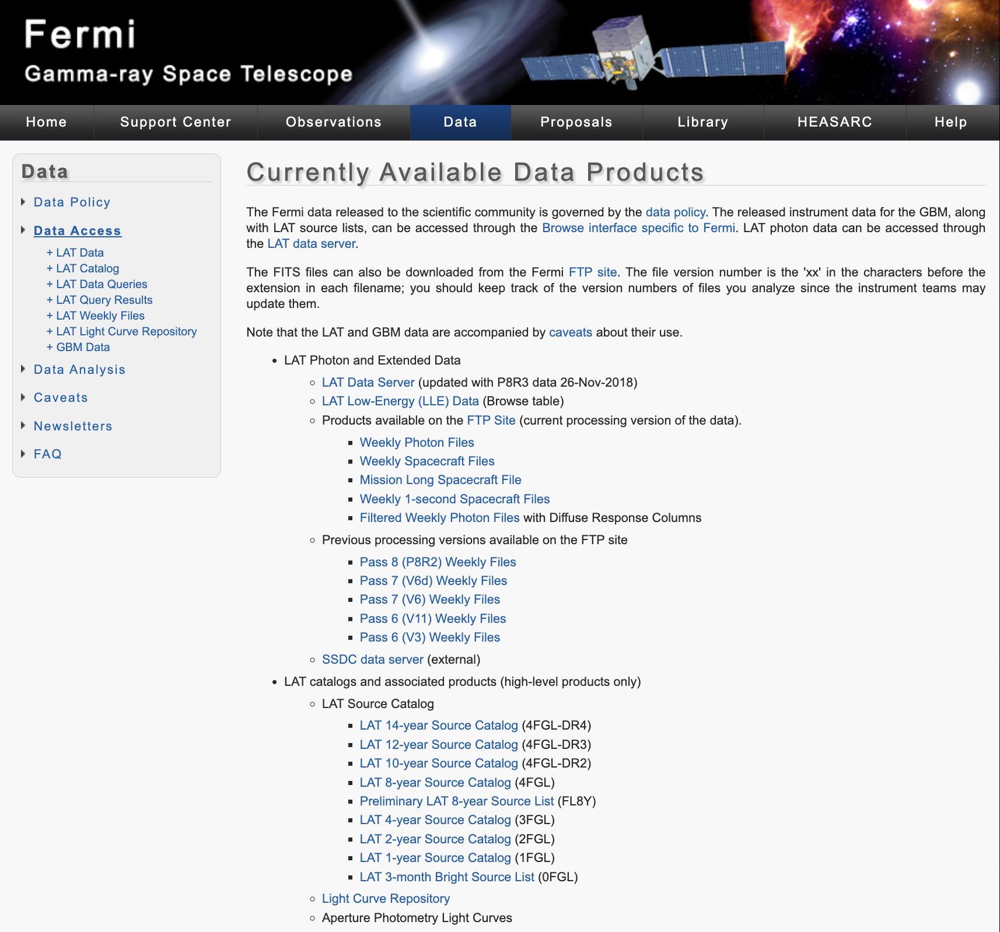

The FSSC website is the source of truth:

`fermi.gsfc.nasa.gov/ssc/data/`

→ **Data Access** → **LAT Data Server**
→ feed it RA/Dec, time range, energy range, ROI radius
→ get back FT1 (photons) + FT2 (spacecraft) by email/URL.

Take the **Photon** type (default). "Extended" only if you need extra reconstruction columns.

---

## The LAT Data Server query page

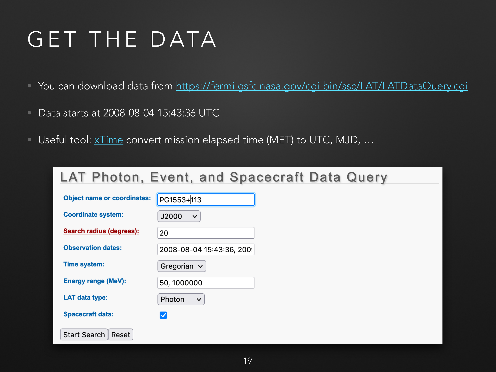

Query for our PG 1553+113 case (one-year window, exactly Meyer's recipe):
- object `PG 1553+113`  →  RA `238.929°`, Dec `+11.190°`
- search radius `20°`
- time range `2008-08-04 15:43:36` → `2009-08-04 15:43:36` (MET `239557417, 271093418`)
- energy `50, 1000000 MeV`
- LAT data type: Photon · Spacecraft data: yes

You get back wget-ready URLs for `*_PH0?.fits` (photons), `*_SC00.fits` (spacecraft).

<div class="ref">screenshot credit: M. Meyer, ISAPP 2021 fermipy hands-on (CC-BY).</div>

---

## What you actually download

Two FITS files per analysis:

- **FT1 — photon event list**
  one row per reconstructed γ candidate:
  `(time, RA, Dec, energy, conversion type, event class, …)`

- **FT2 — spacecraft history**
  one row per ~30 s of mission time:
  `(time, position, pointing, livetime fraction, …)`

Plus, fetched once and reused forever:

- **Galactic diffuse model:** `gll_iem_v07.fits` (~400 MB)
- **Isotropic diffuse template:** `iso_P8R3_SOURCE_V3_v1.txt`
- **Latest catalog** (4FGL-DR4): `gll_psc_v32.fit`
- **IRFs:** shipped inside the Science Tools (`P8R3_SOURCE_V3`)

---

## Event classes & types — the only acronyms you must know

**Event class** = how confident the LAT team is that this is a real photon. Nested bitmasks: `TRANSIENT ⊃ SOURCE ⊃ CLEAN ⊃ ULTRACLEAN ⊃ ULTRACLEANVETO`.
- `SOURCE` (evclass=128) — your default for point-source work
- `CLEAN` / `ULTRACLEAN(VETO)` — cleaner but smaller statistics, used for diffuse
- `TRANSIENT` — looser cuts, used for GRBs

**Event type** = subset by reconstruction quality (also bitmasks).
- `FRONT/BACK` (evtype 1+2): which half of the tracker converted the γ — *FRONT has better PSF*.
- `PSF0/1/2/3` (evtype 4/8/16/32): PSF quartiles.
- `EDISP0/1/2/3`: energy-resolution quartiles.

**Why you care:** combining PSF quartiles into separate analysis components dramatically improves localisation — this is a standard fermipy pattern (Block II).

---

## The official event-class reference

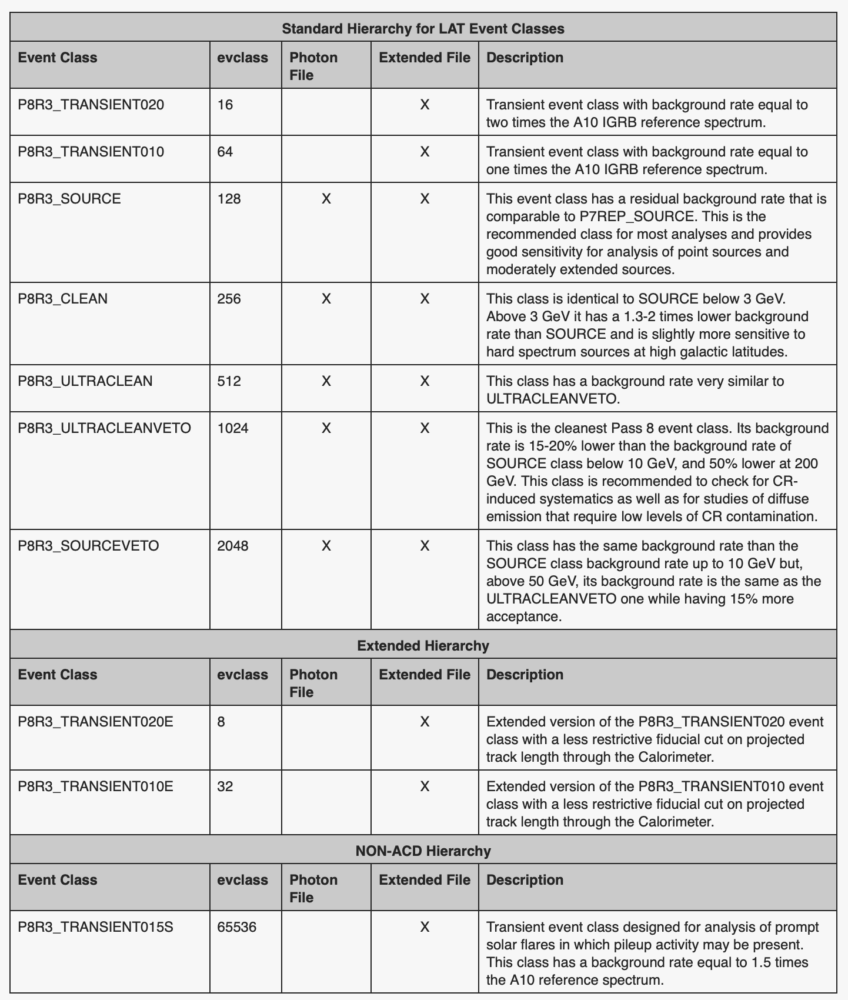

For point-source work in the GeV regime: pick row `P8R3_SOURCE` (evclass=128). Don't go off-script unless you have a reason.

<div class="ref">FSSC, "Cicerone — LAT data quality and event class".</div>

---

## And the recommended cuts table — memorise the shape

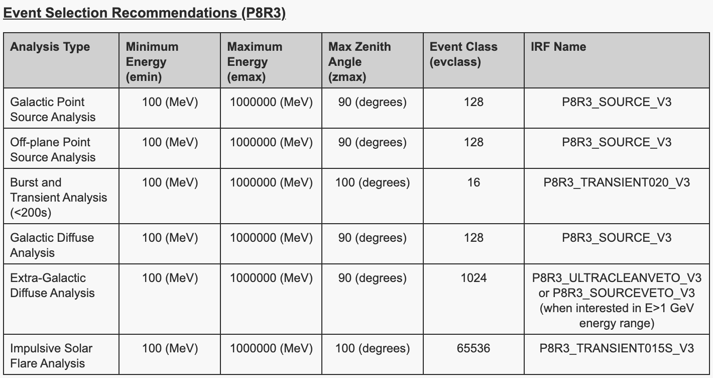

This is what every paper's "Data Selection" paragraph is paraphrasing. The matching IRF name on the right is **not optional** — `evclass=128` *requires* `irfs=P8R3_SOURCE_V3`.

---

## The two commands you will type the most

```bash
# 1. Select photons by class/type/ROI/time/energy/zenith
gtselect evclass=128 evtype=3 \
    infile=@events.txt outfile=PG1553_filtered.fits \
    ra=238.929 dec=11.190 rad=10 \
    tmin=239557417 tmax=271093418 \
    emin=100 emax=1000000 zmax=90

# 2. Apply spacecraft / data-quality time filters
gtmktime scfile=SC.fits evfile=PG1553_filtered.fits \
    filter='(DATA_QUAL>0) && (LAT_CONFIG==1)' \
    roicut=no outfile=PG1553_mktime.fits
```

The recommended `filter` expression — for ALL standard analyses:

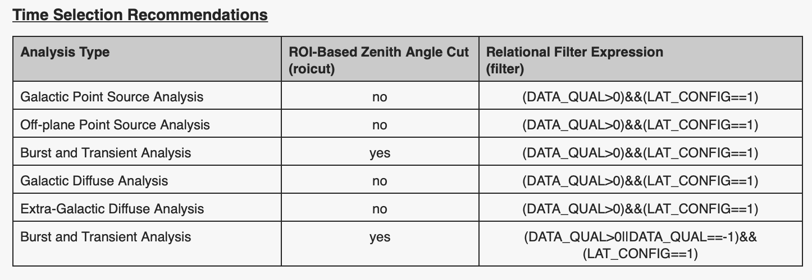

---

## From "by hand" to fermipy

What you just saw is the by-hand workflow:
- query LAT data server → `gtselect` → `gtmktime` → `gtltcube` → `gtbin` → `gtexpcube2` → `gtsrcmaps` → write XML → `gtlike`.

That is **eight commands, twelve hidden parameters, one XML file** before you ever start fitting.

→ this is what fermipy automates. **One `config.yaml` ↔ all of the above.**

Typical defaults for a point-source GeV analysis (the magic numbers):
- E ∈ [100 MeV, 300 GeV], radius 10–15°
- evclass=128 (SOURCE), evtype=3 (FRONT+BACK)
- zmax=90° (limb), data quality good, in survey mode

We'll see exactly these defaults in a `config.yaml` in 4 slides.

---

<!-- _class: lead -->
# Block II — Science Tools → Fermipy → Gammapy
The analysis stack, and PG 1553+113 + TXS 0506+056 end-to-end

---

## Three tools, one likelihood

<div class="twocol">

**Science Tools** (`gtlike`, `gtselect`, …)
- Official Fermi-LAT tools, C++/Python
- The "ground truth" — every published Fermi result was crosschecked here
- ~30 separate `gt*` executables you string together by hand
- Bash + ds9 culture

**Fermipy**
- Python wrapper *around* the Science Tools
- One `config.yaml` → one `GTAnalysis` object
- Sensible defaults, automation (SED, lightcurve, TS map, source finding)
- Output objects are dicts/numpy/yaml — pleasant
- **Still calls the Science Tools underneath.**

</div>

**Gammapy**
- Independent re-implementation, instrument-agnostic, modern Python (numpy, astropy, regions)
- Reads Fermi data via the prepared `gt*` outputs (counts, exposure, PSF, EDISP)
- *The* tool for **joint fits** of LAT + IACT + HAWC + CTA + …

---

## Step zero: what is your research question?

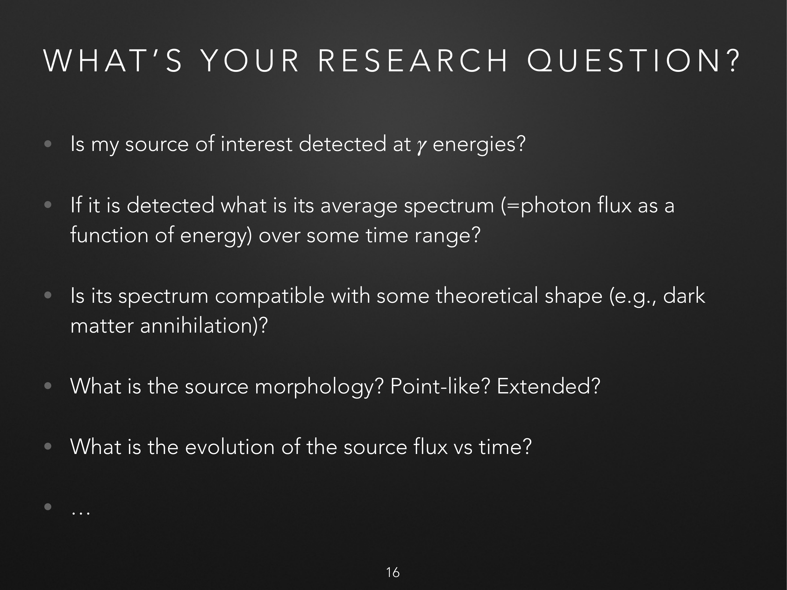

Frame the analysis *before* writing a config. Common LAT questions:

- Is my source detected?
- What is its time-averaged spectrum?
- Is the spectrum compatible with a hypothesis (DM, EBL absorption, …)?
- Is it point-like or extended?
- How does the flux evolve with time?

→ Each of these maps to a specific fermipy method (`gta.fit`, `gta.sed`, `gta.extension`, `gta.lightcurve`, `gta.tsmap`, …) — so the question dictates the workflow.

<div class="ref">slide: M. Meyer, ISAPP 2021.</div>

---

## What's the same in all three?

**The likelihood function.** Same physics, same maths.

For Fermi-LAT data we forward-fold a sky model `M(E, p)` through the IRFs:

$$
\mathcal{L}(\boldsymbol{\theta}) \;=\; \prod_{i} \frac{\mu_i(\boldsymbol{\theta})^{n_i}\, e^{-\mu_i(\boldsymbol{\theta})}}{n_i!}
$$

with the predicted counts in each (sky, energy) bin

$$
\mu_i(\boldsymbol{\theta}) \;=\; \int dE\, dE'\, d\Omega'\;
\underbrace{M(E', \mathbf{p}'; \boldsymbol{\theta})}_{\text{sky model}}\;
\underbrace{R_i(E, E', \mathbf{p}, \mathbf{p}')}_{\text{IRFs}\;A_{\rm eff}\otimes \rm PSF \otimes EDISP}
$$

We always *minimise* $-2\ln\mathcal{L}$ over $\boldsymbol{\theta}$ (source norms, indices, …).

**TS** $= 2(\ln\mathcal{L}_{\rm src+bkg}-\ln\mathcal{L}_{\rm bkg}) \approx \sigma^2$ for a single new free parameter. *(Mattox+ 1996)*

---

## The only diagram you need

```
                 ┌───────────────────────────────────────────────┐
                 │  LAT Data Server  →  FT1 (events), FT2 (sc)   │
                 └───────────────────────────────────────────────┘
                                       │
                       gtselect, gtmktime  (ROI, time, quality cuts)
                                       │
            ┌────────────────────┬─────┴──────┬───────────────────┐
            ▼                    ▼            ▼                   ▼
       gtltcube         gtbin (counts)  gtexpcube2 (expmap)   gtpsf
       (livetime)                                              + edisp
            └─────────┬───────────────┬──────────────────┬──────┘
                      ▼               ▼                  ▼
               ┌───────────────────────────────────────────────┐
               │ gtlike  (binned likelihood)  ← XML source model│
               └───────────────────────────────────────────────┘
                                  │
                Fermipy: GTAnalysis().fit(), .sed(), .lightcurve(), .tsmap()
                Gammapy: MapDataset(counts, exposure, psf, edisp).Fit()
```

`gtltcube` is the slow one (10–30 min). **Compute once, reuse.**

---

## The likelihood inside one picture

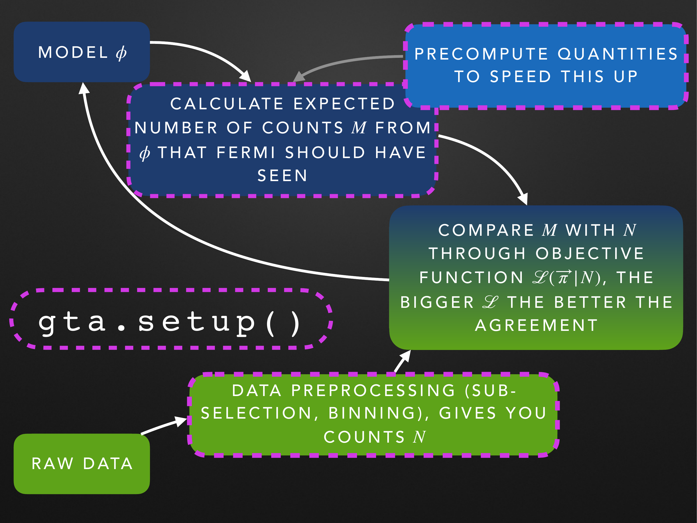

Every step we just ran (`gtbin`, `gtexpcube2`, `gtsrcmaps`, …) populates **one of the boxes on the left**. That whole subgraph — *raw data → counts N, model φ → expected counts M* — is what `gta.setup()` does in fermipy.

Then `gta.fit()` *closes the loop* on the right side: vary $\boldsymbol{\pi}$, recompute $M$, recompute $\ln\mathcal{L}$, repeat until convergence.

<div class="ref">slide: M. Meyer, ISAPP 2021.</div>

---

## Computing the expected counts $M$

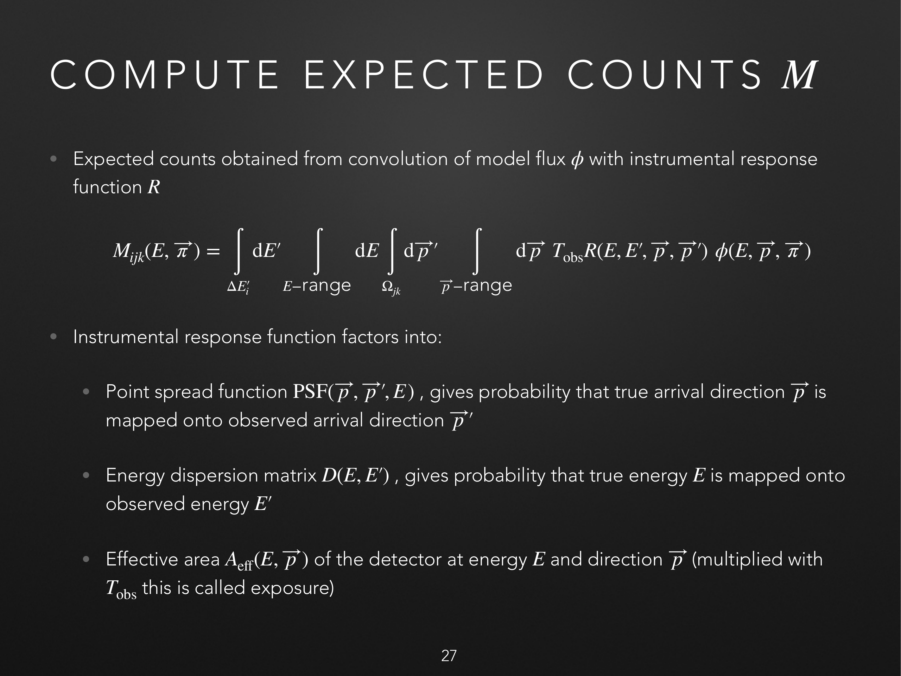

$$
M_{ijk} = \int_{\Delta E'_i} dE' \int_{E\text{-range}} dE \int_{\Omega_{jk}} d\vec{p}' \int_{\vec{p}\text{-range}} d\vec{p}\; T_{\rm obs}\, R(E,E',\vec{p},\vec{p}')\,\phi(E,\vec{p},\boldsymbol{\pi})
$$

The instrument response factors as **PSF × EDISP × A_eff(E,p̄)·T_obs**.

This is what `gtexpcube2` + `gtpsf` + `gtsrcmaps` actually computed for you. Precomputed = expensive but reused at every step of the fit.

<div class="ref">slide: M. Meyer, ISAPP 2021.</div>

---

## Why a 10–20° ROI? Because the LAT PSF is enormous at low E

<div class="twocol">

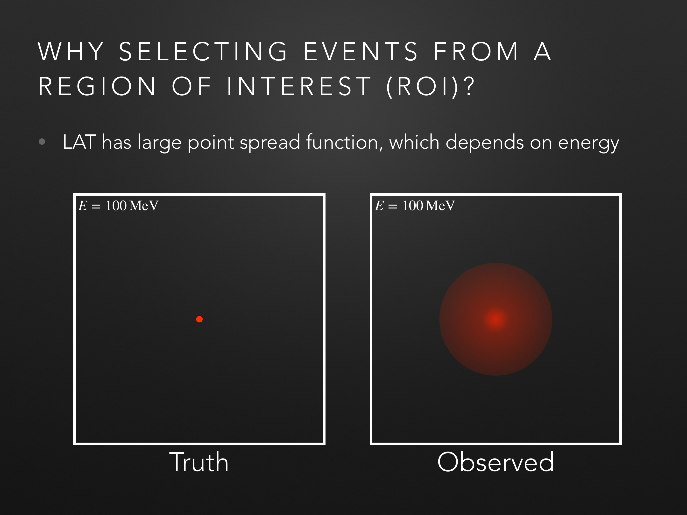

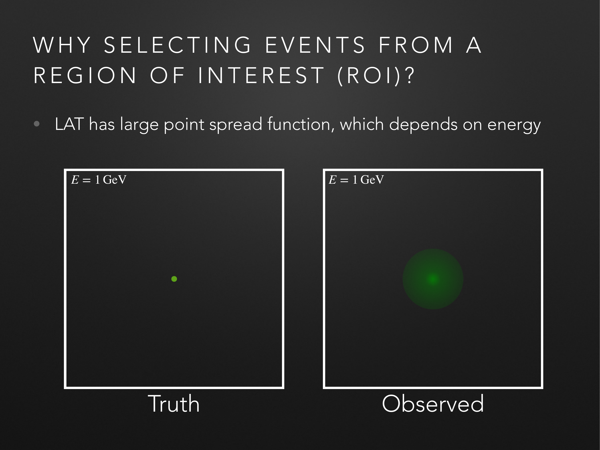

</div>

At 100 MeV the 68%-containment radius is >3°; at 10 GeV it's ~0.1°. **You cannot do a 1°-ROI analysis at 100 MeV** — photons from your target leak out and photons from neighbours leak in.

→ Pick ROI ≈ 10–15° (radius), pick `src_roiwidth` ≈ ROI + 5° to model bleed-in.

<div class="ref">slides: M. Meyer, ISAPP 2021.</div>

---

## Why so many sources in the model?

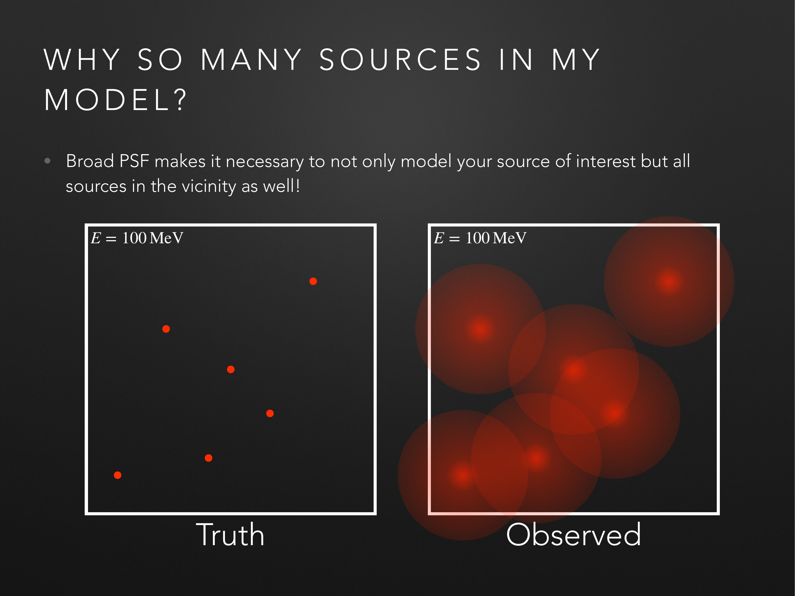

The PSF makes the sky a soup of overlapping blobs at low energy. To fit *your* source correctly, every nearby source has to be in the model — otherwise its photons get attributed to yours.

That is what `model.catalogs: ['4FGL-DR3']` does: it auto-populates the ROI with every catalogued source, so you don't model 50 of them by hand.

→ Plus **galactic + extragalactic diffuse** templates (`galdiff`, `isodiff`) for the rest.

<div class="ref">slide: M. Meyer, ISAPP 2021.</div>

---

## Anatomy of a Fermipy config — PG 1553+113

```yaml
data:
  evfile : events.txt          # list of FT1 files (one per line)
  scfile : SC00.fits           # the FT2 spacecraft file
  ltcube : ltcube_pg1553.fits  # precomputed livetime cube ← TIME SAVER

binning:
  roiwidth   : 10.0            # ROI half-side in deg
  binsz      : 0.1             # spatial bin (deg)
  binsperdec : 8               # log-spaced energy bins

selection:
  emin    : 100                # MeV (Meyer cuts above 100 even though data goes to 50)
  emax    : 1000000            # 1 TeV
  zmax    : 90
  evclass : 128                # SOURCE
  evtype  : 3                  # FRONT+BACK
  tmin    : 239557417          # 2008-08-04 15:43:36 UTC (mission start)
  tmax    : 271093418          # 2009-08-04 15:43:36 UTC (one-year window)
  filter  : 'DATA_QUAL>0 && LAT_CONFIG==1'
  target  : 'PG 1553+113'      # 4FGL J1555.7+1111
```

---

## Anatomy of a Fermipy config — PG 1553+113 (cont.)

```yaml
gtlike:
  edisp        : True                # account for energy dispersion
  edisp_bins   : -1
  irfs         : 'P8R3_SOURCE_V3'    # MUST match evclass/evtype
  edisp_disable: ['isodiff']         # iso template already includes edisp

model:
  src_roiwidth : 20.0                # broader: catch sources outside ROI that bleed in
  galdiff      : '$FERMI_DIFFUSE_DIR/gll_iem_v07.fits'
  isodiff      : 'iso_P8R3_SOURCE_V3_v1.txt'
  catalogs     : ['4FGL-DR3']        # auto-populates the XML model

components:        # 4-component PSF analysis: better localisation
  - { selection: { evtype: 4  } }    # PSF0
  - { selection: { evtype: 8  } }    # PSF1
  - { selection: { evtype: 16 } }    # PSF2
  - { selection: { evtype: 32 } }    # PSF3
```

That's it. You will edit ~6 fields per analysis for the rest of your career.

---

## Live demo 1 — PG 1553+113 in Fermipy

We will go through `notebooks/01_fermipy_pg1553.ipynb`:

```python
from fermipy.gtanalysis import GTAnalysis
gta = GTAnalysis('config.yaml', logging={'verbosity': 3})
gta.setup()                                    # all the gt* glue, runs once
gta.print_roi()                                # what's in your ROI
gta.free_sources(distance=3.0, pars='norm')    # free nearby normalisations
gta.free_source('4FGL J1555.7+1111')           # PG 1553+113, free everything
fit_results = gta.fit()
gta.write_roi('fit_pg1553', make_plots=True)   # save state + diagnostic PNGs
sed = gta.sed('4FGL J1555.7+1111', loge_bins=10)
```

⚠ `gta.setup()` is the slow step (~minutes).
*In the live demo we `gta.load_roi(...)` from precomputed state.*

---

## What `gta.fit()` returns

The dictionary you live with:

- `fit_results['fit_quality']` — 0=converged, 3=no convergence
- `fit_results['loglike']` — the value to subtract for TS
- `gta.roi['<name>']` — source object: `flux`, `flux_err`, `ts`, `param_values`, `param_errors`, `npred`, …
- `make_plots=True` → counts maps, residuals, model maps in `outdir/`

**Diagnostic that catches 90% of bugs:** look at the residual map.
If you see a halo around your source, you fit the wrong spectral shape (or missed a nearby source).

---

## SED — what is actually happening

`gta.sed(name)` does, for each energy bin:

1. Refit the analysis with **only the source's normalisation free in that bin**, all spectral shapes frozen.
2. Compute the bin flux, error, and TS.
3. If TS<4 (default), report a 95% upper limit instead of a point.

So an SED point is a **mini-likelihood-fit per bin**, not a pulled-out histogram.

That's why SEDs are slow (one fit per bin × number of components × profile likelihood).

**Output:** `sed['e_ctr']`, `sed['dnde']`, `sed['dnde_err']`, `sed['dnde_ul95']`, `sed['ts']`.

---

## Live demo 1 — PG 1553+113 SED (precomputed)

[*screenshot/plot of PG 1553+113 SED to be inserted from notebook output*]

Sanity checks that should be muscle memory:

- Spectral index Γ ≈ 1.7 (HBL, IC peak above 100 GeV — hard GeV slope)
- TS in the hundreds–low thousands for one year of data → cleanly detected
- Residual map: featureless within ±3σ
- Catalog comparison: matches 4FGL J1555.7+1111 within ~1σ

**If any of these is off, you don't have a result yet — you have a bug.**

→ Going further (homework / follow-up): build the SED on the *full* 17-year dataset and inspect the lightcurve for the ~2.2-yr quasi-periodicity (Ackermann+ 2015, ApJL 813 L41).

---

## Now: TXS 0506+056

<div class="twocol">

**Why this source?**
- BL Lac, z = 0.3365
- **2017-09-22:** IceCube-170922A, 290 TeV ν, 0.1° from TXS
- LAT flux 6× catalog average → time-correlated
- First credible blazar–neutrino association
- Archival 2014 IceCube flare also coincident, but no γ-ray flare in archival.

**Analysis goal today:**
1. Show the source is detected.
2. Build the SED for the period around the IceCube alert.
3. Build a **light curve** to see the flare.

</div>

<div class="ref">IceCube + Fermi-LAT + MAGIC + … 2018, Science 361, 6398</div>

---

## TXS 0506+056 — the config differs in 3 lines

```yaml
selection:
  emin    : 100
  emax    : 300000
  target  : 'TXS 0506+056'      # ← the only science change
  tmin    : 504921604           # ~ 2016-09-01
  tmax    : 536457604           # ~ 2017-09-01 (+/- around IC170922A)

model:
  catalogs : ['4FGL-DR3']       # the source is 4FGL J0509.4+0541
```

This is the lesson: **you change the target and time range; the entire pipeline replays**.

That is the value of fermipy.

---

## Live demo 2 — TXS 0506+056 lightcurve

```python
import numpy as np
binsize_d   = 30.                              # 30-day bins
tneutrino   = 527806475.4                      # MET of IC170922A
binsbefore  = 13                               # ~13 months pre-event
edges       = tneutrino + (np.arange(-binsbefore, 6) * binsize_d * 86400)
time_bins   = np.column_stack([edges[:-1], edges[1:]])

lc = gta.lightcurve('4FGL J0509.4+0541',
                    free_params=['Prefactor'],
                    time_bins=time_bins)
```

For each bin, fermipy refits with the source's prefactor free → flux + error per bin.

**Expected:** flat near catalog flux for ~9 bins, then a spike around bin 13 (IC170922A).

[*plot from notebook to be shown live*]

---

## What `gta.fit()` is doing

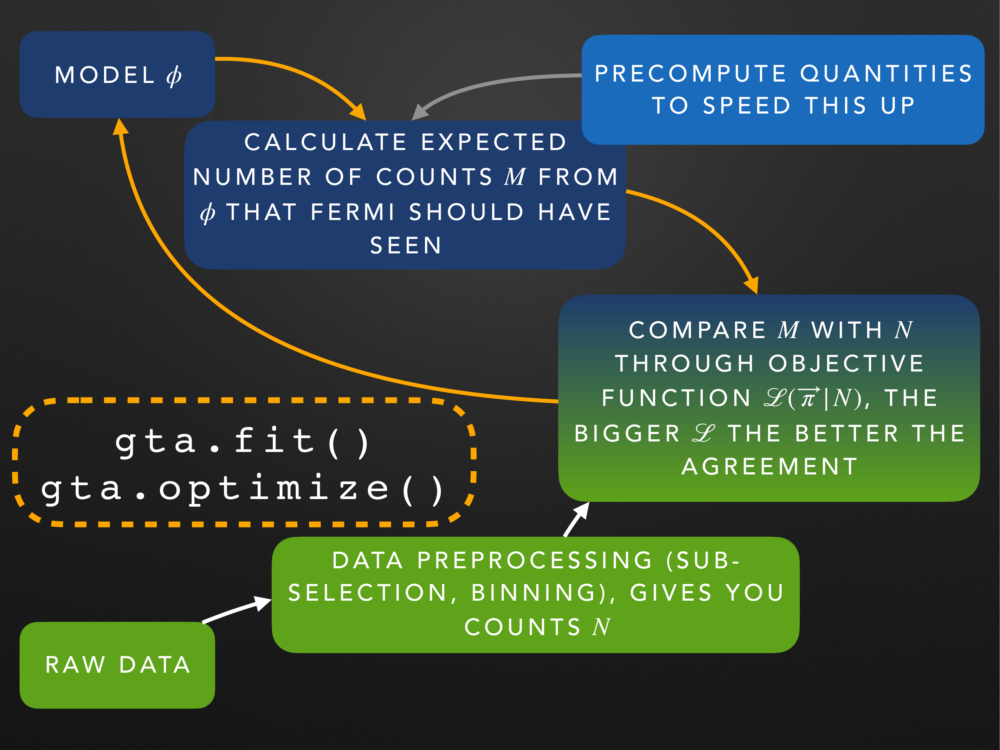

It is closing the loop on the right of the diagram: holds the precomputed quantities fixed, varies the model parameters $\boldsymbol{\pi}$, recomputes the Poisson log-likelihood

$$
\ln \mathcal{L}(\boldsymbol{\pi}|N) \;=\; -M_{\rm tot}(\boldsymbol{\pi}) + \sum_{i,j,k} M_{ijk}(\boldsymbol{\pi})\,\ln N_{ijk}
$$

and asks MINUIT for the maximum.

Output: the parameter best-fits, errors, covariance, and `fit_quality` flag.

<div class="ref">slide: M. Meyer, ISAPP 2021.</div>

---

## Common gotchas (you WILL hit these)

1. **IRF mismatch.** `evclass=128` ↔ `irfs: P8R3_SOURCE_V3`. Mix them and your fluxes are silently wrong.
2. **Energy dispersion off** above ~5 GeV. Always `edisp: True`. Disable for the iso template (it's already convolved).
3. **Diffuse paths.** `$FERMI_DIFFUSE_DIR` must exist; iso file must match the IRF version.
4. **Tiny ROI, large `src_roiwidth`.** Far sources whose PSFs leak in are needed in the model — keep `src_roiwidth` ≥ ROI + ~5°.
5. **`gtltcube` everywhere.** Compute once at maximum zmax, reuse for sub-selections.
6. **Don't trust upper limits below TS≈4.** Below that, the profile likelihood becomes flat and ULs misbehave.
7. **Localisation needs PSF event types**, not the merged `evtype=3`.

---

<!-- _class: lead -->
# Block III — Same data in Gammapy
and the idea of joint multi-instrument fits

---

## Why Gammapy at all?

The Science Tools and Fermipy *only* analyse Fermi-LAT.
But modern γ-ray science is **multi-wavelength + multi-messenger**:

- TXS 0506+056: Fermi-LAT + MAGIC + AGILE + Swift + IceCube
- Gal. centre: Fermi-LAT + H.E.S.S. + HAWC + LHAASO
- A flaring AGN: ground IACT in TeV + Fermi-LAT in GeV → joint SED fit

You don't want to forward-fold *each* dataset in a *different* tool and try to combine χ² by hand.

**Gammapy = one likelihood object that sums datasets from any instrument exposing the GADF / OGIP IRF format.** Fermi-LAT counts/PSF/EDISP are first-class citizens.

<div class="ref">Donath et al. 2023, A&A 678, A157 — *Gammapy: a Python package for γ-ray astronomy*</div>

---

## The Gammapy data model

```
Datasets
   ├── MapDataset  (3D)  ← Fermi-LAT, CTA, HAWC; full counts cube
   │     ├── counts   :  Map( (lon, lat, E_reco) )
   │     ├── exposure :  Map( (lon, lat, E_true) )       ← from gtexpcube2
   │     ├── psf      :  PSFMap( (lon, lat, E_true, rad) ) ← from gtpsf
   │     ├── edisp    :  EDispKernelMap( ... )
   │     ├── background : Map (or model evaluation)
   │     └── models   :  list[SkyModel]
   └── SpectrumDataset  (1D, ON/OFF) ← classic IACT spectra
```

`Fit().run(datasets=[ds_fermi, ds_hess, ds_cta])` minimises the **summed** likelihood.

That's the whole trick.

---

## Live demo 3 — Fermi-LAT in Gammapy (1D)

```python
from gammapy.data import EventList
from gammapy.maps import Map, MapAxis, WcsGeom
from gammapy.irf import PSFMap, EDispKernelMap
from gammapy.datasets import MapDataset
from gammapy.modeling import Fit
from gammapy.modeling.models import (
    PowerLawSpectralModel, PointSpatialModel, SkyModel,
    TemplateSpatialModel, PowerLawNormSpectralModel,
    create_fermi_isotropic_diffuse_model, Models,
)

events   = EventList.read("fermi_3fhl_events_selected.fits.gz")
exposure = Map.read("fermi_3fhl_exposure_cube_hpx.fits.gz")
psf      = PSFMap.read("fermi_3fhl_psf_gc.fits.gz", format="gtpsf")
```

Same files we made with `gt*`. Different forward-folder.

---

## Live demo 3 — building the dataset

```python
geom        = WcsGeom.create(skydir=src_pos, npix=(80,80), binsz=0.1,
                             axes=[MapAxis.from_energy_bounds("10 GeV","2 TeV",4)])
counts      = Map.from_geom(geom); counts.fill_events(events)
exposure_g  = exposure.interp_to_geom(geom.as_energy_true)
edisp       = EDispKernelMap.from_diagonal_response(
                  energy_axis_true=geom.axes["energy_true"],
                  energy_axis     =geom.axes["energy"])

source = SkyModel(
    spectral_model = PowerLawSpectralModel(index=2.4, amplitude="1e-11 cm-2 s-1 TeV-1",
                                           reference="100 GeV"),
    spatial_model  = PointSpatialModel(lon_0=src_pos.l, lat_0=src_pos.b, frame="galactic"),
    name="src")

ds = MapDataset(counts=counts, exposure=exposure_g, psf=psf,
                edisp=edisp, models=Models([source, diffuse_iem, diffuse_iso]))
result = Fit().run([ds])
```

This is *the same fit as fermipy's* — just expressed in gammapy's modelling language.

---

## What you gain

- One language for any instrument that publishes IRFs in GADF/OGIP.
- Free choice of optimiser (`minuit`, `scipy`, `sherpa`).
- MCMC / nested sampling via emcee / nautilus.
- Modern model serialisation (YAML, reproducible).
- **Joint datasets just stack:** `Fit().run([ds_fermi, ds_hess, ds_cta])`.

## What you lose vs. Science Tools/Fermipy

- The **official** LAT IRFs / livetime calculation (you must run `gt*` once).
- Catalog auto-population (Fermipy gives you 4FGL sources for free).
- Battle-testedness against 17 years of LAT publications.

→ **Use both. Fermipy for LAT-only analyses + diagnostics. Gammapy when you cross instruments.**

---

## Sketch — joint Fermi-LAT + IACT SED fit

Conceptually (pseudo-code):

```python
ds_lat   = MapDataset.read("lat_dataset.fits.gz")
ds_hess  = SpectrumDatasetOnOff.read("pks2155_hess.fits.gz")
ds_cta   = SpectrumDataset.read("pks2155_cta_simulated.fits.gz")

source = SkyModel(
    spectral_model = LogParabolaSpectralModel(...),   # ONE model
    spatial_model  = PointSpatialModel(...),
    name = "PKS 2155-304",
)
for d in (ds_lat, ds_hess, ds_cta): d.models = [source, *d.background_models]

result = Fit().run([ds_lat, ds_hess, ds_cta])
```

Internally: $\ln\mathcal{L}_\text{tot}=\sum_d \ln\mathcal{L}_d(\boldsymbol{\theta})$.
The same $\boldsymbol{\theta}$ ties the GeV and TeV points together.

---

<!-- _class: lead -->
# Block IV — Big picture & wrap-up

---

## Which tool, when?

| You want to … | Reach for |
|---|---|
| Reproduce a published Fermi-LAT result, official catalog work | **Science Tools** (+ Fermipy for sanity) |
| Standard Fermi-LAT science: SED, lightcurve, TS map, source finding | **Fermipy** |
| Combine Fermi-LAT with H.E.S.S./MAGIC/CTA/HAWC into one SED | **Gammapy** |
| Modern likelihood (MCMC, nested sampling), custom spectral models | **Gammapy** |
| Just inspect/plot the FT1, no fitting | astropy + matplotlib |
| GRB / transient (loose cuts, all-sky) | Fermi ST + `gtburst` |

**They are not competing.** They sit on the same likelihood. Pick by *what data you have*.

---

## What we did *not* cover (and where to learn it)

- **Pulsar gating, phase-resolved analysis** → `gtpphase`, Fermipy summer school *Pulsar_Analysis*
- **TS maps & blind source finding** → `gta.tsmap()`, `gta.find_sources()`
- **Extended sources** (templates, radial profiles) → `gta.extension()`
- **Dark-matter dwarf-spheroidal stacking** → fermipy DM tutorial; `dmpipe`
- **GBM / occultation** → `gtburst`, summer school GBM notebooks
- **CTAO** → fully gammapy-native; analogue tutorials in gammapy docs

These are all in the GitHub repos shipped in the Docker image — explore.

---

## What I want you to remember

1. **An analysis is data → counts → IRFs → forward-folded model → likelihood.** All three tools do exactly this.
2. **`config.yaml` literacy** is 80% of fermipy fluency. We read every line of one today.
3. **Always look at the residual map.** If it isn't flat, you don't have a fit — you have a hypothesis.
4. **Joint fits live in gammapy.** When a multimessenger paper combines GeV + TeV in one likelihood, this is the machinery.
5. The Docker image you're taking home reproduces every plot in this lecture. Go break it.

---

## References & further reading

**Tools:**
- Fermi Science Tools — https://fermi.gsfc.nasa.gov/ssc/data/analysis/software/
- Fermipy — Wood+ 2017, ICRC; https://fermipy.readthedocs.io/
- Gammapy — Donath+ 2023, A&A 678 A157; https://docs.gammapy.org/

**Sources analysed today:**
- PG 1553+113 — Abdo+ 2010 (Fermi-LAT first detection); Ackermann+ 2015 (~2.2-yr quasi-periodicity), 4FGL J1555.7+1111
- TXS 0506+056 — IceCube/Fermi-LAT/MAGIC+ 2018, Science 361 6398

**Catalogs:**
- 4FGL-DR4 — Ballet+ 2023, arXiv:2307.12546
- 4LAC — Ajello+ 2022 (AGN catalog)

**Pedagogy / image credits:**
- M. Meyer, ISAPP 2021 fermipy hands-on session — origin of the PG 1553+113 example, the likelihood-loop diagrams, the PSF-vs-energy figures, and the multi-source illustrations. Notebook: github.com/me-manu/fermipy-extra
- Fermi Summer School materials — confluence.slac.stanford.edu/display/LSP/
- Fermi Summer School `Data_Exploration.ipynb` — origin of the FSSC images shown in Block I
- Black Hole Group fermipy tutorial — github.com/black-hole-group/fermipy-tutorial (TXS 0506+056)
- Gammapy tutorial *Fermi-LAT with Gammapy* — docs.gammapy.org

---

<!-- _class: lead -->
# Questions?

`docker pull fermipy-gammapy-lecture` *(see README in the lecture repo)*

milena.crnogorcevic@fysik.su.se
